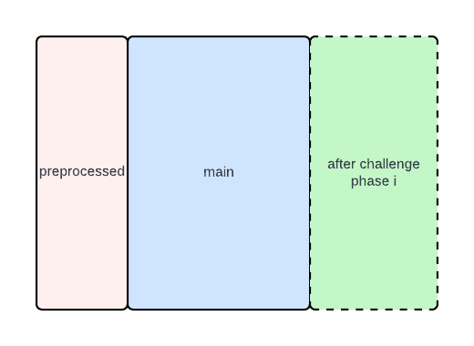

# STARK Backend

### Traits for Constraints

An AIR in our system represents the set of constraints and metadata necessary to generate and verify a STARK proof. This is implemened through the following set of traits, which are split between core plonky3 and our `stark-backend` crate, which provides:

- the ability to handle logUp / interactions
- the ability to handle separate cached traces

#### From plonky3

```rust
pub trait BaseAir<F: Field> {
    fn width(&self) -> usize;
}

pub trait Air<AB: AirBuilder>: BaseAir<AB::F> {
    fn eval(&self, builder: &mut AB);
}

pub trait AirBuilder {
    type F: Field; // use for constants
    type Var: Into<Self::Expr> + Copy + // .. concrete type of row values
    type Expr: AbstractField + // .. most general expression for a constraint
}
```

The way `Air` works is that you always implement `Air<AB>` with respect to "**some** `AirBuilder` with some properties (additional trait bounds)". However in practice we implement `Air` for "**all** `AirBuilder`s with some properties".

The struct implementing `Air` should be **stateless**. The struct should only contain configuration parameters necessary to determine the AIR constraints.

```rust
pub trait BaseAirWithPublicValues<F>: BaseAir<F> {
    fn num_public_values(&self) -> usize {
        0
    }
}

// to use default impl:
impl<F> BaseAirWithPublicValues<F> for MyAir {}
```

#### From `ax-stark-backend`

For cached trace support:

```rust
/// An AIR with 1 or more main trace partitions.
pub trait PartitionedBaseAir<F>: BaseAir<F> {
    /// By default, an AIR has no cached main trace.
    fn cached_main_widths(&self) -> Vec<usize> {
        vec![]
    }
    /// By default, an AIR has only one private main trace.
    fn common_main_width(&self) -> usize {
        self.width()
    }
}

// to use default impl:
impl<F> PartitionedBaseAir<F> for MyAir {}
```

The common main trace is the "usual" main trace. All common main trace across all AIRs are committed into one commitment. Cached main are additional sections of main trace that are committed individually. Cached trace is not used in VM **except** by ProgramAir, where the axVM `Program` is committed into a dedicated commitment.

```rust
pub trait Rap<AB>: Sync
where
    AB: PermutationAirBuilder,
{
    fn eval(&self, builder: &mut AB);
}
```

We auto-implement `Rap<AB>` for any `Air<AB> where AB: InteractionBuilder`. The `Rap` adds in the extension field columns specified by interactions; note that these columns are not specified explicitly in plonky3 trace generation.



So when you implement `Air<AB: InteractionBuilder>` you automatically implement `Rap<AB>` **for some** AirBuilder.

The stark-backend uses three different concrete `AirBuilder` implementations:

- `SymbolicRapBuilder<Val<SC>>`
- `ProverConstraintFolder<'a, SC>`
- `DebugConstraintBuilder<'a, SC>`

that depend on a `SC: StarkGenericConfig`. The `SC` specifies FRI proof system configuration parameters.

```rust
pub trait AnyRap<SC: StarkGenericConfig>:
    Rap<SymbolicRapBuilder<Val<SC>>> // for keygen to extract fixed data about the RAP
    + for<'a> Rap<ProverConstraintFolder<'a, SC>> // for prover quotient polynomial calculation
    + for<'a> Rap<DebugConstraintBuilder<'a, SC>> // for debugging
    + BaseAirWithPublicValues<Val<SC>>
    + PartitionedBaseAir<Val<SC>> {
    // ..
}
```

This is an **auto-implemented** trait on any struct that implements `Air` for all AirBuilders the backend cares about above, for a **specific** `SC`.

The backend wants to be able to prove multiple different AIRs together. So it must take a bunch of different `dyn AnyRap<SC>`. For some sizing reasons, instead it must take `Arc<dyn AnyRap<SC>>` where `Arc` is a smart pointer to get around lifetimes and cloning issues. It is best to always use `Arc`, don't mix `Arc, Rc, Box` for the above purpose.

### Traits for Trace Generation

To generate a proof, we pair an AIR (represented by `Arc<dyn AnyRap<SC>>`) with a set of methods to generate input traces in the `Chip` trait:

```rust
pub trait Chip<SC: StarkGenericConfig> {
    fn air(&self) -> Arc<dyn AnyRap<SC>>;

    /// Generate all necessary input for proving a single AIR.
    fn generate_air_proof_input(self) -> AirProofInput<SC>;
    fn generate_air_proof_input_with_id(self, air_id: usize) -> (usize, AirProofInput<SC>) {
        (air_id, self.generate_air_proof_input())
    }
}
```

The struct implementing `Chip<SC>` is stateful and stores **records**, which are the minimal amount of data necessary to generate the values in the trace matrix. A chip owns exactly one AIR.

- We must have `Chip` generic in `SC` to avoid many issues with returning `Arc<dyn AnyRap<SC>>`.
- If you have an enum of `Chip`s, you can derive `Chip` on the enum using proc-macro `#[derive(Chip)]` from `afs_derive`. The macro expects the enum to be generic in `<F>`.

#### `StarkGenericConfig`

`StarkGenericConfig` is a complicated trait with deeply nested associated types. There are various typedefs to get associated types out of it. The most important is `Val<SC>`; this is the field `F` you want. Import `Val` from `afs_stark_backend::config::Val`, which is a re-export of `p3_uni_stark::Val`.

Usual way to implement:

```rust
impl<SC: StarkGenericConfig> Chip<SC> for MyChip<Val<SC>>
where Val<SC>: PrimeField32 {
    // ..
}
```

If you need `F` for some reason and the above doesn't work, another way is:

```rust
impl<F, SC: StarkGenericConfig> Chip<SC> for MyChip<F>
where Domain<SC>: PolynomialSpace<Val = F> {
    // ..
}
```
