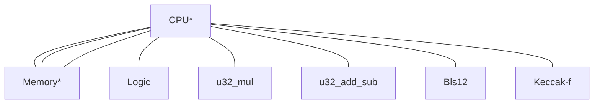

# Modular zkVM ISA

This design is adapted from [Valida](https://github.com/valida-xyz/valida-compiler/issues/2) with changes to the instruction format suggested by Max Gillet to enable easier compatibility with other existing ISAs.

## Architecture

The zkVM consists of a CPU and several coprocessors, which are connected with communication buses:



\* Part of the core (non-optional) configuration

Communication buses are implemented using the logarithmic derivative lookup argument, and are multiplexed for efficiency (i.e. CPU interactions with multiple chips may share the same bus).

There are multiple VM configurations. The "Core" configuration is always present, and provides instructions for basic control flow and memory access. Additional configurations, such as "Field Arithmetic" or "Additional Jump" build upon the core configuration and offer additional instructions.

### Instruction format

Instructions are encoded in groups of 6 field elements. The first element in the group contains the opcode, followed by three elements representing the operands and two address space delimiters: $\text{opcode}, \text{op}_a$, $\text{op}_b$, $\text{op}_c$, $\text{as}_b$, $\text{as}_c$.

### Program ROM

Our VM operates under the Harvard architecture, where program code is stored in a separate address space from main memory. Code is addressed by any field element, starting from $0$. The program counter `pc` stores the location (a field element) of the instruction that is being executed.

Each instruction is stored at a multiple of `INST_WIDTH`.

### Memory

Memory is comprised of word-addressable cells, where the `WORD_SIZE` is a configurable constant of the VM. A given cell contains `WORD_SIZE` field elements. All core and ALU-related instructions operate on cells (i.e. any operand address is word aligned -- a multiple of `WORD_SIZE`). In the VM compiler, the address of newly added local variables in the stack is word aligned.

The address pointer must lie in `[0, p)` so it can be represented by a field element.

As an implementation detail of how to go between word-addressable cells and immediates, we _assume_ the existence of conversion functions

```rust
compose: [F; WORD_SIZE] -> F
decompose: F -> [F: WORD_SIZE]
```

such that `compose(decompose(x)) = x`. When `WORD_SIZE = 1` these are both identity. Otherwise, the default choice is for the VM to specify a `LIMB_BITS` and define

```
compose(word) = sum_{0<=i<WORD_SIZE} word[i] * 2^{LIMB_BITS * i}
```

(i.e., assume a word consists of limbs and compose them in little-endian). When `WORD_SIZE = 4`, the default `LIMB_BITS = 8` corresponds to a byte. The inverse `decompose` is defined under the requirement `WORD_SIZE * LIMB_BITS >= F::bits()`.

### Immediate Values

Immediate values are treated as single field elements. Our VM cannot represent operand values that are greater than the prime $p$, and cannot distinguish between $0$ and $p$. Therefore, any immediate values greater than or equal to $p$ need to be expanded into smaller values.

### Registers

Our zkVM treats general purpose registers as simply pointers to a separate address space, with is also comprised of word-addressable cells with the same `WORD_SIZE`.

There is a single special purpose register `pc` for the program counter, which is currently a single field element. Namely, the program counter cannot be $\ge p$. (We may extend `pc` to multiple field elements to increase the program address space size in the future.)

<!--
Maybe it's simpler if `pc` is also just word-addressable.
-->

### Notation

The following notation is used throughout this document:

**Operand values**: `opa`, `opb`, `opc` denote the value encoded in the operand a, b, or c of the current instruction.

**CPU registers**: `pc` denote the value of the current program counter.

**Addressing**: we support different address spaces via `as_b, as_c`.

- We use `[a]_{as}` to denote the value at pointer location `a` in address space `as`. This is a single field element.
- We use `word[a]_{as}` to denote the slice `[a..a + WORD_SIZE]_{as}` -- this is an array of length `WORD_SIZE` field elements.

We will always have the following fixed address spaces:

| Address Space | Name         |
| ------------- | ------------ |
| `0`           | Immediates   |
| `1`           | Registers    |
| `2`           | Memory       |
| `3`           | Program code |

The `0` address space is not a real address space: it is reserved for denoting immediates. We define `word[a]_0 = decompose(a)` so `compose(word[a]_0) = a`.

Address space `3` is reserved for program code but we do not currently use it.

The number of address spaces supported is a fixed constant of the VM. To start we will fix this number to `4`.

The size (= number of addresses) of each address space can be configured to be some subset of `F`. The memory address space should always be the full size of `F`.

> An element in any address space is always a field element, but the VM _may_ later impose additional bit size constraints on certain address spaces (e.g., everything in memory must be a byte). We do not impose such restrictions at present.

## Instruction list

Each instruction contains 5 field element operands, $a, b, c, d, e$. We omit $d,e$ as operands in the list below but they are used in the description to specify which address space to reference. Each of $a,b,c,d,e$ is a field element. We sometimes replace an operand with `offset` simply for emphasize on its purpose.

Listed below are the instructions offered in each configuration.

### Core

This instruction set is always enabled.

| Mnemonic            | <div style="width:140px">Operands (asm)</div> | Description / Pseudocode                                                                                        |
| ------------------- | --------------------------------------------- | --------------------------------------------------------------------------------------------------------------- |
| **LW** / **LOADW**  | `a, offset, c`                                | Set `word[a]_d <- word[compose(word[c]_d) + offset]_e`. Loads field elements from one address space to another. |
| **SW** / **STOREW** | `a, offset, c`                                | Set `word[compose(word[c]_d) + offset]_e <- word[a]_d`.                                                         |
| **JAL**             | `a, offset, c`                                | Jump to address and link: set `word[a]_d <- decompose(pc + INST_WIDTH)` and `pc <- pc + offset`.                |
| **BEQ**             | `a, b, offset`                                | If `word[a]_d == word[b]_e`, then set `pc <- pc + offset`                                                       |
| **BNE**             | `a, b, offset`                                | If `word[a]_d != word[b]_e`, then set `pc <- pc + offset`                                                       |
| **TERMINATE**       | `_, _, _`                                     | Terminates execution.                                                                                           |
| **SHINTW**          | `a, b, _`                                     | Pops the next word off of the `hint_stream` into `word[word[a]_d + b]_e`.                                       |
| **PUBLISH**         | `a, b, _`                                     | Constrains the public value at index `compose(word[a]_d)` to be equal to `compose(word[b]_e)`.                  |

#### Notes about hints

The `hint_stream` is a stream of words that is processed by calling `SHINTW`. Each call pops the next hint off the stream and writes it to the given place in memory. The `hint_stream` is populated by phantom instructions such as `HINT_INPUT` (resets `hint_stream` to be the next input) and `HINT_BITS` (resets `hint_stream` to be the bit decomposition of a given variable).

:::info
Core instructions were chosen so a subset of RISC-V instructions can be directly transpiled to the core instructions, where x0-31 registers are mapped to `word[0-31]_1` register address space.

<!--Separate special LOADW / STOREW commands would be needed to compose words into a single register.-->

:::

### Field arithmetic

This instruction set does native field operations. Some operations may be infeasible if the address space imposes additional bit size constraints.

For brevity we use the notation `fe[a]_{as} := compose(word[a]_{as})`.

| Mnemonic | <div style="width:170px">Operands (asm)</div> | Description                                                                                                |
| -------- | --------------------------------------------- | ---------------------------------------------------------------------------------------------------------- |
| **FADD** | `a, b, c`                                     | Set `word[a]_d <- decompose(fe[b]_d + fe[c]_e)`. This opcode presumes `a,b` are in the same address space. |
| **FSUB** | `a, b, c`                                     | Set `word[a]_d <- decompose(fe[b]_d - fe[c]_e)`.                                                           |
| **FMUL** | `a, b, c`                                     | Set `word[a]_d <- decompose(fe[b]_d * fe[c]_e)`.                                                           |
| **FDIV** | `a, b, c`                                     | Set `word[a]_d <- decompose(fe[b]_d / fe[c]_e)`.                                                           |

Note that field arithmetic instructions only operate on the first element in a cell, which represents a field element instead of a single byte.

### Extension field arithmetic

We will add special instruction set extensions for opcodes to perform degree 4 extension field arithmetic. For brevity we use the notation `fe[a]_{as} := compose(word[a]_{as})`.

All elements in the field extension can be represented as a vector `[a_0, a_1, a_2, a_3]` which represents the polynomial $a_0 + a_1x + a_2x^2 + a_3x^3$. Given address space `as` and address `a` we define `a_0` as the element `fe[a]_{as}`, `a_1` as the element `fe[a+WORD_SIZE]_{as}`, `a_2` as the element `fe[a+2*WORD_SIZE]_{as}`, and `a_3` as the element `fe[a+3*WORD_SIZE]_{as}`.

We want to implement the field extension operations **FE4ADD, FE4SUB, BBE4MUL,** and **BBE4INV**. For the first three operations, we take operands `a, b, c`, setting `compose(word[a+i*WORD_SIZE]_d)` for `0 <= i < 4` to the corresponding coefficient in the result of applying the operation to the field extension elements given by `fe[b+i*WORD_SIZE]_d` and `fe[c+i*WORD_SIZE]_e` for `0 <= i < 4`.

Specifically, for **FE4ADD** and **FE4SUB** we have

| Mnemonic   | <div style="width:170px">Operands (asm)</div> | Description                                                                                                                                                     |
| ---------- | --------------------------------------------- | --------------------------------------------------------------------------------------------------------------------------------------------------------------- |
| **FE4ADD** | `a, b, c`                                     | Set `word[a+i*WORD_SIZE]_d <- decompose(fe[b+i*WORD_SIZE]_d + fe[c+i*WORD_SIZE]_e)` for `0 <= i < 4`. This opcode presumes `a,b` are in the same address space. |
| **FE4SUB** | `a, b, c`                                     | Set `word[a+i*WORD_SIZE]_d <- decompose(fe[b+i*WORD_SIZE]_d - fe[c+i*WORD_SIZE]_e)` for `0 <= i < 4`.                                                           |

For **BBE4MUL** and **BBE4INV**, we will implement BabyBear quartic (deg 4) field extension with the irreducible polynomial is $x^4 - 11$.

For **BBE4MUL**, let the first element represent the polynomial $a_0 + a_1x + a_2x^2 + a_3x^3$ and the second represent the polynomial $b_0 + b_1x + b_2x^2 + b_3x^3$. Then, multiplying we find

$$
\begin{align*}
(a_0 + \dots + a_3x^3)(b_0 + \dots + b_3x^3) &= (a_0b_0 + 11(a_1b_3 + a_2b_2 + a_3b_1)) \\
&+ (a_0b_1 + a_1b_0 + 11(a_2b_3 + a_3b_2))x \\
&+ (a_0b_2 + a_1b_1 + a_2b_0 + 11a_3b_3)x^2 \\
&+ (a_0b_3 + a_1b_2 + a_2b_1 + a_3b_0)x^3.
\end{align*}
$$

For **BBE4INV**, we have three operands `a, b, c`, where c is ignored, and we set `compose(word[a+i*WORD_SIZE]_d)` for `0 <= i < 4` to the corresponding coefficient of the inverse of the field extension element given by `fe[b+i*WORD_SIZE]_d` for `0 <= i < 4`.

Concretely, suppose we are inverting the element $a = a_0 + a_1x + a_2x^2 + a_3x^3$. That is, we want to compute $1 / a$. Write $a' = a_0 - a_1x + a_2x^2 - a_3x^3$. Then, $1/a = a'/(aa')$ and let the denominator $aa' = b$. By construction, $b$ will have coefficients of $x$ and $x^3$ equal to $0$. Specifically, we find
$$b = (a_0^2 - 11(2a_1a_3 - a_2^2)) + (2a_0a_2 - a_1^2 - 11a_3^2)x^2.$$

Let $b_0 = a_0^2 - 11(2a_1a_3 - a_2^2)$ and $b_2 = (2a_0a_2 - a_1^2 - 11a_3^2)$, so that $b = b_0 + b_2x^2$. We want to compute $a'/b$. Now, define $b' = b_0 - b_2x^2$, and we may write $1/a = a'/b = a'b'/(bb')$. But
$$bb' = (b_0 + b_2x^2)(b_0 - b_2x^2) = b_0^2 - 11b_2^2,$$

which is an element of the original field which we define as $c$. So, we may simply invert $c$ and we find $1/a = a'/b = a'b'/c = a'b'c^{-1}$. This will give the correct result except when $c^{-1}$ is undefined, which is when $a = 0$.

### Hash function precompiles

We have special opcodes to enable different precompiled hash functions.

Only subsets of these opcodes will be turned on depending on the VM use case.
| Mnemonic | <div style="width:140px">Operands (asm)</div> | Description / Pseudocode |
| ----------- | --- | ----- |
| **COMPRESS_POSEIDON2** `[CHUNK, PID]` <br/><br/> Here `CHUNK` and `PID` are **constants** that determine different opcodes. `PID` is an internal identifier for particular Poseidon2 constants dependent on the field (see below). | `a, b, c` | This is a special 2-to-1 compression function.<br/><br/>Let `state[i] <- fe[fe[b]_d + i * WORD_SIZE]_e` for `i = 0..CHUNK` and `state[CHUNK + i] <- fe[fe[c]_d + i * WORD_SIZE]_e` for `i = 0..CHUNK`, so `state` has type `[F; 2*CHUNK]`.<br/><br/>Let `new_state` be the Poseidon2 permutation applied to `state`. Set `word[fe[a]_d + i * WORD_SIZE]_e <- decompose(new_state[i])` for `i = 0..CHUNK`. |
| **PERM_POSEIDON2** `[WIDTH, PID]` | `a, offset=0, c` (nonzero `offset` TODO) | Let `state[i] <- fe[fe[c]_d + offset + i * WORD_SIZE]_e` for `i = 0..WIDTH` so `state` has type `[F; WIDTH]`.<br/><br/>Let `new_state` be the Poseidon2 permutation applied to `state`. Set `word[fe[a]_d + i * WORD_SIZE]_e <- decompose(new_state[i])` for `i = 0..WIDTH`. |
| **PERM_KECCAK** | `a, offset=0, c` | Assume `WORD_SIZE=1` for now. Let `state[i] <- word[word[c]_d + i]_e` for `i = 0..WIDTH` where `state[i]` is `u16`.<br/><br/>Let `new_state` be the `keccak-f` permutation applied to `state`. Set `word[word[a]_d + i]_e <- new_state[i]` for `i = 0..WIDTH`. |

The `PID` is just some identifier to provide domain separation between different Poseidon2 constants. For now we can set:
| `PID` | Description |
| ----- | ----------- |
| 0 | [`POSEIDON2_BABYBEAR_16_PARAMS`](https://github.com/HorizenLabs/poseidon2/blob/bb476b9ca38198cf5092487283c8b8c5d4317c4e/plain_implementations/src/poseidon2/poseidon2_instance_babybear.rs#L2023C20-L2023C48) but the Mat4 used is Plonky3's with a Monty reduction |

and only support `CHUNK = 8` and `WIDTH = 16` above.

### Excluded

These instructions are never enabled. Any program that actually executes them cannot be verified.
| Mnemonic | <div style="width:140px">Operands (asm)</div> | Description / Pseudocode |
| ----------- | --- | ----- |
| **FAIL** | `_, _, _` | Causes execution to fail. |
| **PRINTF** | `a, _, _` | Prints `compose(word[a]_d)`. |

The **FAIL** instruction is meant to allow programs to clearly signal that something has gone wrong, and will cause trace generation to fail. **TERMINATE** and **FAIL** can be seen as analogues of acceptance and rejection in the context of Turing machines.

The **PRINTF** instruction is used for debugging purposes, and will print the relevant field element during trace generation. However, though **PRINTF** will not cause trace generation to fail, the resulting trace cannot be verified, just as with **FAIL**.

### More coming soon

Other instruction set extensions (for example to support RISC-V) coming soon.

We will closely follow RISC-V assembly, making modifications as necessary. The most important difference between our zkVM assembly and RV32IM is that instead of registers `x0-31`, we only have a special-purpose register `pc` and the address space `1[]` for general purpose registers.
