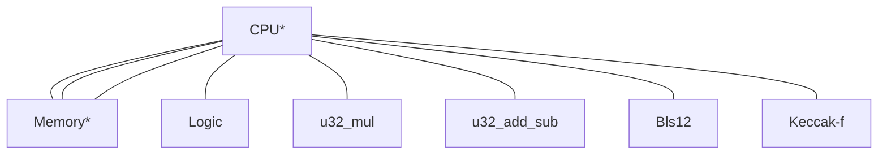

# Modular zkVM ISA

This design is adapted from [Valida](https://github.com/valida-xyz/valida-compiler/issues/2) with changes to the
instruction format suggested by Max Gillet to enable easier compatibility with other existing ISAs.

## Architecture

The zkVM consists of a CPU and several coprocessors, which are connected with communication buses:



\* Part of the core (non-optional) configuration

Communication buses are implemented using the logarithmic derivative lookup argument, and are multiplexed for
efficiency (i.e. CPU interactions with multiple chips may share the same bus).

There are multiple VM configurations. The "Core" configuration is always present, and provides instructions for basic
control flow and memory access. Additional configurations, such as "Field Arithmetic" or "Additional Jump" build upon
the core configuration and offer additional instructions.

### Instruction format

Instructions are encoded in groups of 6 field elements. The first element in the group contains the opcode, followed by
three elements representing the operands and two address space delimiters: $\text{opcode}, \text{op}_a$, $\text{op}_b$,
$\text{op}_c$, $\text{as}_b$, $\text{as}_c$.

### Program ROM

Our VM operates under the Harvard architecture, where program code is stored in a separate address space from main
memory. Code is addressed by any field element, starting from $0$. The program counter `pc` stores the location (a field
element) of the instruction that is being executed.

Each instruction is stored at a multiple of `INST_WIDTH`.

### Memory

Memory is comprised of addressable cells, each cell containing a single field element. Instructions of the VM may
operate on single cells or may operate on a contiguous list of cells. Such a contiguous list is called a _block_, and
an memory access (read/write) to a block is a _block access_.
The number of cells in a block access is restricted to four possible values: 1, 4, 8, or 16. Block accesses must be
aligned, meaning that in a block access of size $N$, the starting pointer must be divisible by $N$ (as an integer).

We also leave open the possibility in the future that different address spaces (see below) can be dedicated to handling
data with certain block sizes, effectively declaring a word-size for that address space, but this is not currently
implemented. At present there are two types of blocks we have in mind

- **[FVEC]** A block consisting of `[F; N]` arbitrary field elements.
- **[LIMB]** A block consisting of `[F; N]` field elements, where each field element has as its canonical representation
  a limb in `[0, 2^LIMB_BITS)`. This would emulate a word in RISC-V memory.

While not relevant to the ISA itself, the ZK circuit implementation does usually represent a block `[F; N]` as `N`
contiguous field elements in the same row of the trace matrix.

### Immediate Values

Immediate values are treated as single field elements. Our VM cannot represent operand values that are greater than the
prime $p$ and cannot distinguish between $0$ and $p$ (or any two integers whose difference is a multiple of $p$).
Therefore, any immediate values greater than or equal to $p$ need to be expanded into smaller values.

### Registers

Our zkVM treats general purpose registers simply as pointers to a separate address space, which is also comprised of
addressable cells.

There is a single special purpose register `pc` for the program counter of type `F`. Namely, the program counter cannot
be $\ge p$. (We may extend `pc` to multiple field elements to increase the program address space size in the future.)

### Notation

The following notation is used throughout this document:

**Operand values**: `opa`, `opb`, `opc` denote the value encoded in the operand a, b, or c of the current instruction.

**CPU registers**: `pc` denotes the value of the current program counter.

**Addressing**: we support different address spaces via `as_b, as_c`.

- We use `[a]_{as}` to denote the single-cell value at pointer location `a` in address space `as`. This is a single
  field element.
- We use `[a:N]_{as}` to denote the slice `[a..a + N]_{as}` -- this is an length-`N` array of field elements.

We will always have the following fixed address spaces:

| Address Space | Name         |
|---------------|--------------|
| `0`           | Immediates   |
| `1`           | Registers    |
| `2`           | Memory       |
| `3`           | Program code |

Address space `0` is not a real address space: it is reserved for denoting immediates: We define `[a]_0 = a`.

Address space `3` is reserved for program code but we do not currently use it.

<!--
(The following is not needed right now:) The number of address spaces supported is a fixed constant of the VM. To start we will fix this number to `4`.
-->

the size (= number of addresses) of each address space can be configured to be some subset of `F`. The memory address
space (`2`) should always be the full size of `F`.

> A memory cell in any address space is always a field element, but the VM _may_ later impose additional bit size
> constraints on certain address spaces (e.g., everything in memory must be a byte).

## Instruction list

Each instruction contains 5 field element operands, $a, b, c, d, e$. We omit $d,e$ as operands in the list below but
they are used in the description to specify which address space to reference. Each of $a,b,c,d,e$ is a field element. We
sometimes replace an operand with `offset` simply to emphasize its purpose.

All instruction types are divided into classes, mostly based on purpose and nature of the operation (e.g., Core
instructions, U256 instructions, Modular instructions, etc).
Instructions within each class are usually handled by the same chip, but this is not always the case (for example, if
one of the operations requires much more trace columns than all others).
Internally, certain non-intersecting ranges of opcodes (which are internally just a `usize`) are distributed among the
enabled operation classes, so that there is no collision between the classes.
But the operations from different classes may have the same mnemonic. For instance, `ADD` instruction may denote field
addition, u256 addition or addition modulo a long prime, depending on the class this operation is in.
This allows a more flexible and independent workflow in different chips, and, unlike the conventional opcode lists, we
do not have to introduce names like `ADD256`, `FADD` and `SECP256K1_COORD_ADD` just to specify what operation we mean.

Listed below are the instructions offered in each configuration.

### Core

This instruction set is always enabled.

| Mnemonic            | <div style="width:140px">Operands (asm)</div> | Description / Pseudocode                                                                                                              |
|---------------------|-----------------------------------------------|---------------------------------------------------------------------------------------------------------------------------------------|
| **L** / **LOAD**    | `a, offset, c`                                | Set `[a]_d <- [[c]_d + offset]_e`. Loads a cell from one address space to another.                                                    |
| **S** / **STORE**   | `a, offset, c`                                | Set `[[c]_d + offset]_e <- [a]_d`.                                                                                                    |
| **L2** / **LOAD2**  | `a, offset, c, size`                          | Set `[a]_d <- [[c]_d + [f]_g * size + offset]_e`. Loads cell a from one address space to another using a variable multiple of `size`. |
| **S2** / **STORE2** | `a, offset, c, size`                          | Set `[[c]_d + [f]_g * size + offset]_e <- [a]_d`.                                                                                     |
| **JAL**             | `a, offset, c`                                | Jump to address and link: set `[a]_d <- (pc + INST_WIDTH)` and `pc <- pc + offset`.                                                   |
| **BEQ**             | `a, b, offset`                                | If `[a]_d == [b]_e`, then set `pc <- pc + offset`                                                                                     |
| **BNE**             | `a, b, offset`                                | If `[a]_d != [b]_e`, then set `pc <- pc + offset`                                                                                     |
| **TERMINATE**       | `_, _, _`                                     | Terminates execution.                                                                                                                 |
| **SHINTW**          | `a, b, _`                                     | Pops the next word off of the `hint_stream` into `[[a]_d + b]_e`.                                                                     |
| **PUBLISH**         | `a, b, _`                                     | Constrains the public value at index `[a]_d` to equal `[b]_e`.                                                                        |

#### Notes about hints

The `hint_stream` is a stream of values that is processed by calling `SHINTW`. Each call pops the next hint off the
stream and writes it to the given cell in memory. The `hint_stream` is populated via phantom instructions such
as `HINT_INPUT` (resets `hint_stream` to be the next program input), `HINT_BITS` (resets `hint_stream` to be the bit
decomposition of a given variable, with a length known at compile time), and `HINT_BYTES` (byte analog of `HINT_BITS`).

:::info
Core instructions were chosen so a subset of RISC-V instructions can be directly transpiled to the core instructions,
where x0-31 registers are mapped to address space `1` and each register is represented as `4` memory cells, with each
cell a byte.
:::

### Field arithmetic

This instruction set does native field operations. Some operations may be infeasible if the address space imposes
additional bit size constraints.

| Mnemonic | <div style="width:170px">Operands (asm)</div> | Description                                                            |
|----------|-----------------------------------------------|------------------------------------------------------------------------|
| **ADD**  | `a, b, c`                                     | Set `[a]_d <- [b]_e + [c]_f`.                                          |
| **SUB**  | `a, b, c`                                     | Set `[a]_d <- [b]_e - [c]_f`.                                          |
| **MUL**  | `a, b, c`                                     | Set `[a]_d <- [b]_e * [c]_f`.                                          |
| **DIV**  | `a, b, c`                                     | Set `[a]_d <- [b]_e / [c]_f`. Division by zero causes a runtime error. |

### Extension field arithmetic

We add several special instruction set extensions for opcodes to perform degree `D` extension field arithmetic. **Such
an instruction set extension should only be enabled when field arithmetic instruction set is enabled.**

#### BabyBear Quartic Extension Field

This is only enabled when `F = BabyBear`. The quartic extension field is defined by the irreducible polynomial $x^4 -
11$ (this choice matches Plonky3, but we note that Risc0 uses the polynomial $x^4 + 11$ instead).
All elements in the field extension can be represented as a vector `[a_0, a_1, a_2, a_3]` which represents the
polynomial $a_0 + a_1x + a_2x^2 + a_3x^3$ over `BabyBear`.

| Mnemonic    | <div style="width:170px">Operands (asm)</div> | Description                                                                                                |
|-------------|-----------------------------------------------|------------------------------------------------------------------------------------------------------------|
| **FE4ADD**  | `a, b, c`                                     | Set `[a:4]_d <- [b:4]_d + [c:4]_e` with extension field addition.                                          |
| **FE4SUB**  | `a, b, c`                                     | Set `[a:4]_d <- [b:4]_d - [c:4]_e` with extension field subtraction.                                       |
| **BBE4MUL** | `a, b, c`                                     | Set `[a:4]_d <- [b:4]_d * [c:4]_e` with extension field multiplication.                                    |
| **BBE4DIV** | `a, b, c`                                     | Set `[a:4]_d <- [b:4]_d / [c:4]_e` with extension field division. Division by zero causes a runtime error. |

Below we explain the specific implementation of these operations.

For **BBE4MUL**, let the first element represent the polynomial $a_0 + a_1x + a_2x^2 + a_3x^3$ and the second represent
the polynomial $b_0 + b_1x + b_2x^2 + b_3x^3$. Then, multiplying we find

$$
\begin{align*}
(a_0 + \dots + a_3x^3)(b_0 + \dots + b_3x^3) &= (a_0b_0 + 11(a_1b_3 + a_2b_2 + a_3b_1)) \\
&+ (a_0b_1 + a_1b_0 + 11(a_2b_3 + a_3b_2))x \\
&+ (a_0b_2 + a_1b_1 + a_2b_0 + 11a_3b_3)x^2 \\
&+ (a_0b_3 + a_1b_2 + a_2b_1 + a_3b_0)x^3.
\end{align*}
$$

For **BBE4DIV**, we are multiplying by the inverse. Suppose we must compute the inverse of the element $a = a_0 + a_1x +
a_2x^2 + a_3x^3$. That is, we want to compute $1 / a$. Write $a' = a_0 - a_1x + a_2x^2 - a_3x^3$. Then, $1/a = a'/(aa')$
and let the denominator $aa' = b$. By construction, $b$ will have coefficients of $x$ and $x^3$ equal to $0$.
Specifically, we find
$$b = (a_0^2 - 11(2a_1a_3 - a_2^2)) + (2a_0a_2 - a_1^2 - 11a_3^2)x^2.$$

Let $b_0 = a_0^2 - 11(2a_1a_3 - a_2^2)$ and $b_2 = (2a_0a_2 - a_1^2 - 11a_3^2)$, so that $b = b_0 + b_2x^2$. We want to
compute $a'/b$. Now, define $b' = b_0 - b_2x^2$, and we may write $1/a = a'/b = a'b'/(bb')$. But
$$bb' = (b_0 + b_2x^2)(b_0 - b_2x^2) = b_0^2 - 11b_2^2,$$

which is an element of the original field which we define as $c$. So, we may simply invert $c$ and we find $1/a = a'/b =
a'b'/c = a'b'c^{-1}$. This will give the correct result except when $c^{-1}$ is undefined, which is when $a = 0$.

### Unsigned 32-bit integer instructions

The following are instructions on unsigned 32-bit integers. The instructions are chosen to be compatible with RV32I.

<!--
[jpw] I chose bytes instead of u16 here to go with RV32 memory cell alignment. This can be changed as an optimization if needed.
-->

```
compose(w: [F; 4]) -> u32 {
    return sum_{i=0}^3 w[i] * 2^{8i}
}
```

and let `decompose: u32 -> [F; 4]` be the inverse operation.

Immediates are handled as follows: `compose([a:4]_0) = a.as_canonical_u32()`. Note that RV32 immediates never exceed
20-bits, so any immediate bits inside a 31-bit field.

<!--
A note on CASTF below: support for casting arbitrary field elements can also be supported by doing a big int less than between the block and the byte decomposition of `p`, but this seemed unnecessary and complicates the constraints.
-->

| Mnemonic  | <div style="width:170px">Operands (asm)</div> | Description                                                                                                                                                                                                                                                                                 |
|-----------|-----------------------------------------------|---------------------------------------------------------------------------------------------------------------------------------------------------------------------------------------------------------------------------------------------------------------------------------------------|
| **CASTF** | `a, b, _`                                     | Cast a field element represented as `u32` into four bytes in little-endian: Set `[a:4]_d` to the unique array such that `sum_{i=0}^3 [a + i]_d * 2^{8i} = [b]_e` where `[a + i]_d < 2^8` for `i = 0..2` and `[a + 3]_d < 2^6`. This opcode constrains that `[b]_e` must be at most 30-bits. |
| **SLTU**  | `a, b, c`                                     | Set `[a]_d <- compose([b; 4]_e) < compose([c; 4]_f) ? decompose(1) : decompose(0)`. The address space `d` is not allowed to be zero.                                                                                                                                                        |
| **LUI**   | `a, b, _`                                     | Set `[a:4]_1 <- decompose([b]_0 << 12)`. The immediate `[b]_0` is constrained to be at most 20 bits.                                                                                                                                                                                        |
| **AUIPC** | `a, b, _`                                     | Set `[a:4]_1 <- decompose(pc + ([b]_0 << 12))`. The immediate `[b]_0` is constrained to be at most 20 bits, where addition is mod `2^32`.                                                                                                                                                   |

### U256 Arithmetic and Logical Operations

We name these opcodes `ADD`, etc, below for brevity but in the code they must distinguish between `ADD` for `u32`
and `ADD` for `u256`.

Let `Word256 = [u8; 32]`. Although we work over a 31-bit field, and we can in theory represent `u256` as larger limbs (
e.g. 16bits), we choose to operate on bytes because
(1): a lot of data we work with are naturally in bytes and
(2): to be consistent with modular arithmetic below.
Explicitly, the conversion between the limb representation and the actual unsigned integer is given by

```
compose(w: Word256) -> u256 {
    return sum_{i=0}^31 w[i] * 2^{8i}
}
```

(in other words, little-endian).

and let `decompose: u256 -> [F; 32]` be the inverse operation.

To save some notation, we will let `u256[a]_d := compose([a:32]_d)` below.
The address spaces `d, e` are not allowed to be zero in any instructions below unless otherwise specified.

#### Arithmetic Operations

| Mnemonic | <div style="width:170px">Operands (asm)</div> | Description                                                                                          |
|----------|-----------------------------------------------|------------------------------------------------------------------------------------------------------|
| **ADD**  | `a, b, c`                                     | Set `[a:32]_d <- decompose(u256[b]_d + u256[c]_e)` where addition is mod `2^256`.                    |
| **SUB**  | `a, b, c`                                     | Set `[a:32]_d <- decompose(u256[b]_d - u256[c]_e)` where subtraction is mod `2^256` with wraparound. |
| **MUL**  | `a, b, c`                                     | Set `[a:32]_d <- decompose(u256[b]_d * u256[c]_e)` where multiplication is mod `2^256`.              |

<!--
We don't need this yet:
| **DIV** | `a, b, c` | Set `[a:16]_d <- decompose(u256[b]_d // u256[c]_e)` where subtraction is mod `2^256` with wraparound. |
-->

#### Comparison Operations

| Mnemonic | <div style="width:170px">Operands (asm)</div> | Description                                                          |
|----------|-----------------------------------------------|----------------------------------------------------------------------|
| **LT**   | `a, b, c`                                     | Set `[a]_d <- u256[b]_d < u256[c]_e ? decompose(1) : decompose(0)`.  |
| **EQ**   | `a, b, c`                                     | Set `[a]_d <- u256[b]_d == u256[c]_e ? decompose(1) : decompose(0)`. |

### Modular arithmetic

For some technical reasons we cannot have limb bits greater than 12 (it will overflow the field element in intermediate
computations), so the big uints are represented as `BigUint = [u8; 32]`.

We will have similar notation as `u256` and let `bigu[a]_d: BigUint` denote the array of limbs `bigu[a:32]_d`. The
conversion between limbs and the big uint is the same as for `u256` above.
The modulus we will use for now are the coordinate field and scalar field of `secp256k1`.

| Mnemonic | <div style="width:170px">Operands (asm)</div> | Description                                                                                                                     |
|----------|-----------------------------------------------|---------------------------------------------------------------------------------------------------------------------------------|
| **ADD**  | `a, b, c`                                     | Set `bigu[[a]_d]_e <- decompose(bigu[[b]_d]_e + bigu[[c]_d]_e)` where addition is in the given (coordinate/scalar) field.       |
| **SUB**  | `a, b, c`                                     | Set `bigu[[a]_d]_e <- decompose(bigu[[b]_d]_e - bigu[[c]_d]_e)` where subtraction is in the given (coordinate/scalar) field.    |
| **MUL**  | `a, b, c`                                     | Set `bigu[[a]_d]_e <- decompose(bigu[[b]_d]_e * bigu[[c]_d]_e)` where multiplication is in the given (coordinate/scalar) field. |
| **DIV**  | `a, b, c`                                     | Set `bigu[[a]_d]_e <- decompose(bigu[[b]_d]_e / bigu[[c]_d]_e)` where division is in the given (coordinate/scalar) field.       |

### Elliptic curve operations

An elliptic curve point `EcPoint(x, y)` is a pair of big uint in a prime field (secp256k1). `x` and `y` will be
represented as `BigUint` with 32 8-bit limbs, and thus an `EcPoint` needs 64 elements in total.
Let `EcArray = [u8; 64]`.

```
compose_ec(w: EcArray) -> EcPoint {
    let x = compose(w[..32]);
    let y = compose(w[32..]);
    return EcPoint(x, y);
}
```

where `compose` is the one in modular arithmetic above. And let `decompose_ec(p: EcPoint) -> EcArray ` be the inverse
of `compose_ec`.

| Mnemonic                | <div style="width:170px">Operands (asm)</div> | Description                                                                                                                                                                                                   |
|-------------------------|-----------------------------------------------|---------------------------------------------------------------------------------------------------------------------------------------------------------------------------------------------------------------|
| **SECP256K1_EC_ADD_NE** | `a, b, c`                                     | Set `EcArray[[a]_d]_e <- decompose_ec(EcArray[[b]_d]_e + EcArray[[c]_d]_e)` where `+` is group operation on secp256k1. Assume the x coordinate of two inputs are distinct, the result is undefined otherwise. |
| **SECP256K1_EC_DOUBLE** | `a, b, _`                                     | Set `EcArray[[a]_d]_e <- decompose_ec(EcArray[[b]_d]_e + EcArray[[b]_d]_e)` where `+` is group operation on secp256k1. This double the input point.                                                           |

### Hash function precompiles

We have special opcodes to enable different precompiled hash functions.

Only subsets of these opcodes will be turned on depending on the VM use case.

| Mnemonic                                                                                                                                                                                                                           | <div style="width:140px">Operands (asm)</div> | Description / Pseudocode                                                                                                                                                                                                                                                                                                                                                                                                                                                                                                              |
|------------------------------------------------------------------------------------------------------------------------------------------------------------------------------------------------------------------------------------|-----------------------------------------------|---------------------------------------------------------------------------------------------------------------------------------------------------------------------------------------------------------------------------------------------------------------------------------------------------------------------------------------------------------------------------------------------------------------------------------------------------------------------------------------------------------------------------------------|
| **COMPRESS_POSEIDON2** `[CHUNK, PID]` <br/><br/> Here `CHUNK` and `PID` are **constants** that determine different opcodes. `PID` is an internal identifier for particular Poseidon2 constants dependent on the field (see below). | `a, b, c`                                     | Applies the Poseidon2 compression function to the inputs `[[b]_d:CHUNK]_e` and `[[c]_d:CHUNK]_e`, writing the result to `[[a]_d:CHUNK]_e`.<br/><br/>The address space `d` is **not** allowed to be `0`.                                                                                                                                                                                                                                                                                                                               |
| **PERM_POSEIDON2** `[WIDTH, PID]`                                                                                                                                                                                                  | `a, b, 0`                                     | Applies the Poseidon2 permutation function to `[[b]_d:WIDTH]_e` and writes the result to `[[a]_d:WIDTH]_e`. <br/><br/> Each array of `WIDTH` elements is read/written in two batches of size `CHUNK`. The address space `d` is **not** allowed to be `0`. This is nearly the same as `COMPRESS_POSEIDON2` except that the whole input state is contiguous in memory, and the full output state is written to memory.                                                                                                                  |
| **KECCAK256**                                                                                                                                                                                                                      | `a, b, c, d, e, f`                            | Let `input` be the **variable length** byte array of length `len <- [c]_f` loaded from memory via `input[i] <- [[b]_d + i]_e` for `i = 0..len`. Let `output = keccak256(input)` as `[u8; 32]`. This opcode sets `[[a]_d + i]_e <- output[i]` for `i = 0..32`. This opcode assumes that the input memory cells are **bytes** and currently **does** range check them. **Safety:** The output is currently **not** range checked to be bytes. <!--ATTENTION: THIS MAY CHANGE IN FUTURE--> The output is written to memory as **bytes**. |

For Poseidon2, the `PID` is just some identifier to provide domain separation between different Poseidon2 constants. For
now we can set:

| `PID` | Description                                                                                                                                                                                                                                                         |
|-------|---------------------------------------------------------------------------------------------------------------------------------------------------------------------------------------------------------------------------------------------------------------------|
| 0     | [`POSEIDON2_BABYBEAR_16_PARAMS`](https://github.com/HorizenLabs/poseidon2/blob/bb476b9ca38198cf5092487283c8b8c5d4317c4e/plain_implementations/src/poseidon2/poseidon2_instance_babybear.rs#L2023C20-L2023C48) but the Mat4 used is Plonky3's with a Monty reduction |

and only support `CHUNK = 8` and `WIDTH = 16` in BabyBear Poseidon2 above. For this setting, the input (of size `WIDTH`)
is read in two batches of size `CHUNK`, and, similarly, the output is written in either one or two batches of
size `CHUNK`, depending on the output size of the corresponding opcode.

### Excluded

These instructions are never enabled. Any program that actually executes them cannot be verified.

| Mnemonic   | <div style="width:140px">Operands (asm)</div> | Description / Pseudocode  |
|------------|-----------------------------------------------|---------------------------|
| **FAIL**   | `_, _, _`                                     | Causes execution to fail. |
| **PRINTF** | `a, _, _`                                     | Prints `[a]_d`.           |

The **FAIL** instruction is meant to allow programs to clearly signal that something has gone wrong, and will cause
trace generation to fail. **TERMINATE** and **FAIL** can be seen as analogues of acceptance and rejection in the context
of Turing machines.

The **PRINTF** instruction is used for debugging purposes, and will print the relevant field element during trace
generation. However, though **PRINTF** will not cause trace generation to fail, the resulting trace cannot be verified,
just as with **FAIL**.

### More coming soon

Other instruction set extensions (for example to support RISC-V) coming soon.

We will closely follow RISC-V assembly, making modifications as necessary. The most important difference between our
zkVM assembly and RV32IM is that instead of registers `x0-31`, we only have a special-purpose register `pc` and the
address space `1[]` for general purpose registers.
