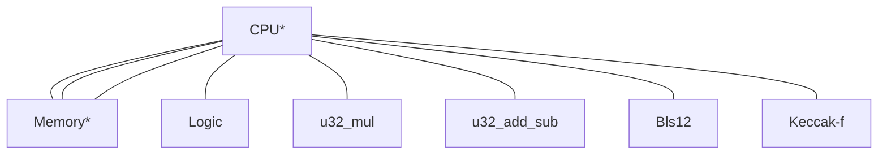

# Modular zkVM ISA

This design is adapted from [Valida](https://github.com/valida-xyz/valida-compiler/issues/2) with changes to the instruction format suggested by Max Gillet to enable easier compatibility with other existing ISAs.

## Architecture

The zkVM consists of a CPU and several coprocessors, which are connected with communication buses:



\* Part of the core (non-optional) configuration

Communication buses are implemented using the logarithmic derivative lookup argument, and are multiplexed for efficiency (i.e. CPU interactions with multiple chips may share the same bus).

There are multiple VM configurations. The "Core" configuration is always present, and provides instructions for basic control flow and memory access. Additional configurations, such as "Field Arithmetic" or "Additional Jump" build upon the core configuration and offer additional instructions.

### Instruction format

Instructions are encoded in groups of 6 field elements. The first element in the group contains the opcode, followed by three elements representing the operands and two address space delimiters: $\text{opcode}, \text{op}_a$, $\text{op}_b$, $\text{op}_c$, $\text{as}_b$, $\text{as}_c$.

### Program ROM

Our VM operates under the Harvard architecture, where program code is stored in a separate address space from main memory. Code is addressed by any field element, starting from $0$. The program counter `pc` stores the location (a field element) of the instruction that is being executed.

Each instruction is stored at a multiple of `INST_WIDTH`.

### Memory

Memory is comprised of word-addressable cells, where the `WORD_SIZE` is a configurable constant of the VM (and consequently of the ISA). A given _word_ contains `WORD_SIZE` field elements (referred to as _cells_). Presently, all opcodes operate on words (i.e. any operand address is word aligned -- a multiple of `WORD_SIZE`). In the VM compiler, the address of newly added local variables in the stack or heap is word aligned.

We introduce the following types to clarify the different types associated with memory access:

```rust
AddressType = F;
Word([F; WORD_SIZE]);
PcType = F;
```

where address pointers are of type `AddressType = F`, memory values are of type `Word`, which is `WORD_SIZE` field elements, and the program counter is of type `PcType`.

The VM _may_ impose additional conditions on the `Word` type. We also leave open the possibility in the future that different address spaces (see below) can have different `Word` types and even different word sizes -- but this is not currently implemented. At present there are two `Word` sizes we have in mind:

- **[FVEC]** `Word` consists of `[F; WORD_SIZE]` arbitrary field elements. `AddressType = F`.
- **[LIMB]** `Word` consists of `[F; WORD_SIZE]` field elements, where each field element is a limb in `[0, 2^LIMB_BITS)`. This would emulate a word in RISC-V memory. `AddressType = F` or `Word` (e.g., necessary for 64-bit addresses).

While not relevant to the ISA itself, the ZK circuit implementation does usually represent `Word` as `WORD_SIZE` contiguous field elements in the same row of the trace matrix.

#### Converters

To define certain opcodes below, the VM needs to specify conversion functions between types:

```rust
proj_a: Word -> AddressType
emb_op: F -> AddressType
emb_a: AddressType -> Word
emb_pc: PcType -> Word
```

with the property that `proj(emb_pc(x)) = x` for all `x`. We will likely use `AddressType = F` and `PcType = F` for the foreseeable future, so we assume `emb_a = emb_pc` and `emb_op` is identity. We drop the subscripts and just use `proj` and `emb = emb_a`.

Here are default converters in the two scenarios [FVEC] and [LIMB] mentioned above:

- **[FVEC]** `proj(word) = word[0]` and `emb(pc) = [pc, 0, .., 0]`.
- **[LIMB]** `proj(word) = sum_{0<=i<WORD_SIZE} word[i] * 2^{LIMB_BITS * i}` and `emb(pc)` is the little-endian representation of `pc` in limbs of `LIMB_BITS` each.

### Immediate Values

Immediate values are treated as single field elements. Our VM cannot represent operand values that are greater than the prime $p$, and cannot distinguish between $0$ and $p$. Therefore, any immediate values greater than or equal to $p$ need to be expanded into smaller values.

### Registers

Our zkVM treats general purpose registers as simply pointers to a separate address space, which is also comprised of
word-addressable cells with the same `WORD_SIZE`.

There is a single special purpose register `pc` for the program counter of type `PcType` (which is currently a single field element `F`). Namely, the program counter cannot be $\ge p$. (We may extend `pc` to multiple field elements to increase the program address space size in the future.)

<!--
Maybe it's simpler if `pc` is also just word-addressable.
-->

### Notation

The following notation is used throughout this document:

**Operand values**: `opa`, `opb`, `opc` denote the value encoded in the operand a, b, or c of the current instruction.

**CPU registers**: `pc` denotes the value of the current program counter.

**Addressing**: we support different address spaces via `as_b, as_c`.

- We use `[a]_{as}` to denote the single-cell value at pointer location `a` in address space `as`. This is a single field element.
- We use `word[a]_{as}` to denote the slice `[a..a + WORD_SIZE]_{as}` -- this is an array of length `WORD_SIZE` field elements.

We will always have the following fixed address spaces:

| Address Space | Name         |
| ------------- | ------------ |
| `0`           | Immediates   |
| `1`           | Registers    |
| `2`           | Memory       |
| `3`           | Program code |

Address space `0` is not a real address space: it is reserved for denoting immediates. We
define `word[a]_0 = emb(a)` so `proj(word[a]_0) = a`.

Address space `3` is reserved for program code but we do not currently use it.

<!--
(The following is not needed right now:) The number of address spaces supported is a fixed constant of the VM. To start we will fix this number to `4`.
-->

The size (= number of addresses) of each address space can be configured to be some subset of `F`. The memory address space (`2`) should always be the full size of `F`.

> A memory cell in any address space is always a field element, but the VM _may_ later impose additional bit size constraints on certain address spaces (e.g., everything in memory must be a byte). See the `Word` type above.

## Instruction list

Each instruction contains 5 field element operands, $a, b, c, d, e$. We omit $d,e$ as operands in the list below but
they are used in the description to specify which address space to reference. Each of $a,b,c,d,e$ is a field element. We
sometimes replace an operand with `offset` simply to emphasize its purpose.

Listed below are the instructions offered in each configuration.

### Core

This instruction set is always enabled.

| Mnemonic              | <div style="width:140px">Operands (asm)</div> | Description / Pseudocode                                                                                                                                      |
| --------------------- | --------------------------------------------- | ------------------------------------------------------------------------------------------------------------------------------------------------------------- |
| **LW** / **LOADW**    | `a, offset, c`                                | Set `word[a]_d <- word[proj(word[c]_d) + offset]_e`. Loads a word from one address space to another.                                                          |
| **SW** / **STOREW**   | `a, offset, c`                                | Set `word[proj(word[c]_d) + offset]_e <- word[a]_d`.                                                                                                          |
| **LW2** / **LOADW2**  | `a, offset, c, size`                          | Set `word[a]_d <- word[proj(word[c]_d) + (proj[f]_g) * size + offset]_e`. Loads word a from one address space to another using a variable multiple of `size`. |
| **SW2** / **STOREW2** | `a, offset, c, size`                          | Set `word[proj(word[c]_d) + (proj[f]_g) * size + offset]_e <- word[a]_d`.                                                                                     |
| **JAL**               | `a, offset, c`                                | Jump to address and link: set `word[a]_d <- emb(pc + INST_WIDTH)` and `pc <- pc + offset`.                                                                    |
| **BEQ**               | `a, b, offset`                                | If `word[a]_d == word[b]_e`, then set `pc <- pc + offset`                                                                                                     |
| **BNE**               | `a, b, offset`                                | If `word[a]_d != word[b]_e`, then set `pc <- pc + offset`                                                                                                     |
| **TERMINATE**         | `_, _, _`                                     | Terminates execution.                                                                                                                                         |
| **SHINTW**            | `a, b, _`                                     | Pops the next word off of the `hint_stream` into `word[proj(word[a]_d) + b]_e`.                                                                               |
| **PUBLISH**           | `a, b, _`                                     | Constrains the public value at index `proj(word[a]_d)` to be equal to `proj(word[b]_e)`.                                                                      |

#### Notes about hints

The `hint_stream` is a stream of words that is processed by calling `SHINTW`. Each call pops the next hint off the stream and writes it to the given place in memory. The `hint_stream` is populated by phantom instructions such as `HINT_INPUT` (resets `hint_stream` to be the next input) and `HINT_BITS` (resets `hint_stream` to be the bit decomposition of a given variable, with a length known at compile time).

:::info
Core instructions were chosen so a subset of RISC-V instructions can be directly transpiled to the core instructions, where x0-31 registers are mapped to `word[0-31]_1` register address space.

<!--Separate special LOADW / STOREW commands would be needed to compose words into a single register.-->

:::

### Field arithmetic

This instruction set does native field operations. Some operations may be infeasible if the address space imposes additional bit size constraints.

This instruction set should only be enabled when `Word` type represents `[F; WORD_SIZE]` without bit size constraints. In this case the field operations are automatically vectorized.

| Mnemonic | <div style="width:170px">Operands (asm)</div> | Description                                                                                         |
| -------- | --------------------------------------------- | --------------------------------------------------------------------------------------------------- |
| **FADD** | `a, b, c`                                     | Set `word[a]_d <- word[b]_e + word[c]_f`. This opcode presumes `a,b` are in the same address space. |
| **FSUB** | `a, b, c`                                     | Set `word[a]_d <- word[b]_e - word[c]_f`.                                                           |
| **FMUL** | `a, b, c`                                     | Set `[a + i]_d <- [b + i]_e * [c + i]_f` for `i = 0..WORD_SIZE`.                                    |
| **FDIV** | `a, b, c`                                     | Set `[a + i]_d <- [b + i]_e / [c + i]_f` for `i = 0..WORD_SIZE`.                                    |

### Extension field arithmetic

We will add several special instruction set extensions for opcodes to perform degree `D` extension field arithmetic. **Such an instruction set extension should only be enabled when field arithmetic instruction set is enabled and `D <= WORD_SIZE`.** (We allow `D < WORD_SIZE` because when `F = Mersenne31` we may have `D = 6` and we may want `WORD_SIZE` to stay a multiple of 4 for Poseidon.)

There are no separate instructions for field extension addition and subtraction since we can directly use the vectorized field arithmetic instructions.

#### BabyBear Quartic Extension Field

This is only enabled when `F = BabyBear`. We have `D = 4`.
All elements in the field extension can be represented as a vector `[a_0, a_1, a_2, a_3]` which represents the polynomial $a_0 + a_1x + a_2x^2 + a_3x^3$.

We will always convert a word `w` to an extension field element by taking `w[..D]`. Similarly, we embed `[a_0, a_1, a_2, a_3]` into `Word` via `[a_0, a_1, a_2, a_3, 0, ..]`. For brevity of notation, we will omit these conversions below.

We want to implement the field extension operations **BBE4MUL** and **BBE4INV**.
For **BBE4MUL** and **BBE4INV**, we will implement BabyBear quartic (deg 4) field extension with respect to the irreducible polynomial $x^4 - 11$ (note this follows Plonky3, whereas Risc0 uses $x^4 + 11$).

| Mnemonic    | <div style="width:170px">Operands (asm)</div> | Description                                                                                                                              |
| ----------- | --------------------------------------------- | ---------------------------------------------------------------------------------------------------------------------------------------- |
| **BBE4MUL** | `a, b, c`                                     | Set `word[a]_d <- word[b]_d * word[c]_e` with extension field multiplication. This opcode presumes `a, b` are in the same address space. |
| **BBE4INV** | `a, _, c`                                     | Set `word[a]_d <- 1 / word[c]_e` with extension field inverse. We ignore operand `b` and use `c` to allow different address spaces.      |

Below we explain the specific implementation of these operations.

For **BBE4MUL**, let the first element represent the polynomial $a_0 + a_1x + a_2x^2 + a_3x^3$ and the second represent the polynomial $b_0 + b_1x + b_2x^2 + b_3x^3$. Then, multiplying we find

$$
\begin{align*}
(a_0 + \dots + a_3x^3)(b_0 + \dots + b_3x^3) &= (a_0b_0 + 11(a_1b_3 + a_2b_2 + a_3b_1)) \\
&+ (a_0b_1 + a_1b_0 + 11(a_2b_3 + a_3b_2))x \\
&+ (a_0b_2 + a_1b_1 + a_2b_0 + 11a_3b_3)x^2 \\
&+ (a_0b_3 + a_1b_2 + a_2b_1 + a_3b_0)x^3.
\end{align*}
$$

For **BBE4INV**, suppose we are inverting the element $a = a_0 + a_1x + a_2x^2 + a_3x^3$. That is, we want to compute $1 / a$. Write $a' = a_0 - a_1x + a_2x^2 - a_3x^3$. Then, $1/a = a'/(aa')$ and let the denominator $aa' = b$. By construction, $b$ will have coefficients of $x$ and $x^3$ equal to $0$. Specifically, we find
$$b = (a_0^2 - 11(2a_1a_3 - a_2^2)) + (2a_0a_2 - a_1^2 - 11a_3^2)x^2.$$

Let $b_0 = a_0^2 - 11(2a_1a_3 - a_2^2)$ and $b_2 = (2a_0a_2 - a_1^2 - 11a_3^2)$, so that $b = b_0 + b_2x^2$. We want to compute $a'/b$. Now, define $b' = b_0 - b_2x^2$, and we may write $1/a = a'/b = a'b'/(bb')$. But
$$bb' = (b_0 + b_2x^2)(b_0 - b_2x^2) = b_0^2 - 11b_2^2,$$

which is an element of the original field which we define as $c$. So, we may simply invert $c$ and we find $1/a = a'/b = a'b'/c = a'b'c^{-1}$. This will give the correct result except when $c^{-1}$ is undefined, which is when $a = 0$.

### Unsigned 32-bit integer instructions

The following are instructions on unsigned 32-bit integers. The instructions are chosen to be compatible with RV32I.
When these instructions are enabled, the ISA must have `WORD_SIZE >= 4`.
For operations besides CASTU, any VM word will be assumed to have the first `4` cells consisting of **bytes** and the remaining cells equal to zero. We convert from word to `u32` via

<!--
[jpw] I chose bytes instead of u16 here to go with RV32 memory cell alignment. This can be changed as an optimization if needed.
-->

```
compose(w: Word) -> u32 {
    return sum_{i=0}^3 w[i] * 2^{8i}
}
```

and let `decompose: u32 -> Word` be the inverse operation.

Immediates are handled as follows: `compose(word[a]_0) = a.as_canonical_u32()`. Note that RV32 immediates never exceed 20-bits, so any immediate bits inside a 31-bit field.

<!--
A note on CASTU below: support for casting arbitrary field elements can also be supported by doing a big int less than between the word and the byte decomposition of `p`, but this seemed unnecessary and complicates the constraints.
-->

| Mnemonic  | <div style="width:170px">Operands (asm)</div> | Description                                                                                                                                                                                                                                                                                            |
| --------- | --------------------------------------------- | ------------------------------------------------------------------------------------------------------------------------------------------------------------------------------------------------------------------------------------------------------------------------------------------------------ |
| **CASTU** | `a, b, _`                                     | Set `word[a]_d` to the unique word such that `sum_{i=0}^3 [a + i]_d * 2^{8i} = proj(word[b]_e)` where `[a + i]_d < 2^8` for `i = 0..3` and `[a + 3]_d < 2^6`. This opcode enforces `proj(word[b]_e)` must be at most 30-bits. If `WORD_SIZE > 4` then all remaining cells in `word[a]_d` must be zero. |
| **SLTU**  | `a, b, c`                                     | Set `word[a]_d <- compose(word[b]_d) < compose(word[c]_e) ? emb(1) : emb(0)`. The address space `d` is not allowed to be zero.                                                                                                                                                                         |

### U256 Arithmetic and Logical Operations

We name these opcodes `ADD`, etc, below for brevity but in the code they must distinguish between `ADD` for `u32` and `ADD` for `u256`.

Since we work over a 31-bit field, we will represent `u256` as 16-bit limbs. Let `Word256 = [u16; 16]`. For notational purposes we let `w256[a]_d: Word256` denote the array of limbs `w256[a + i]_d` for i = 0..16`. Explicitly, the conversion between the limb representation and the actual unsigned integer is given by

**Note:** we assume 16-bit limbs are the most efficient for cell-saving, but this can be changed if needed.

```
compose(w: Word256) -> u256 {
    return sum_{i=0}^15 w[i] * 2^{16i}
}
```

(in other words, little-endian).

and let `decompose: u256 -> Word256` be the inverse operation.

To save some notation, we will let `u256[a]_d := compose(w256[a]_d)` below.
The address spaces `d, e` are not allowed to be zero in any instructions below unless otherwise specified.

#### Arithmetic Operations

| Mnemonic | <div style="width:170px">Operands (asm)</div> | Description                                                                                           |
| -------- | --------------------------------------------- | ----------------------------------------------------------------------------------------------------- |
| **ADD**  | `a, b, c`                                     | Set `w256[a]_d <- decompose(u256[b]_d + u256[c]_e)` where addition is mod `2^256`.                    |
| **MUL**  | `a, b, c`                                     | Set `w256[a]_d <- decompose(u256[b]_d * u256[c]_e)` where multiplication is mod `2^256`.              |
| **SUB**  | `a, b, c`                                     | Set `w256[a]_d <- decompose(u256[b]_d - u256[c]_e)` where subtraction is mod `2^256` with wraparound. |

<!--
We don't need this yet:
| **DIV** | `a, b, c` | Set `w256[a]_d <- decompose(u256[b]_d // u256[c]_e)` where subtraction is mod `2^256` with wraparound. |
-->

#### Comparison Operations

| Mnemonic | <div style="width:170px">Operands (asm)</div> | Description                                                  |
| -------- | --------------------------------------------- | ------------------------------------------------------------ |
| **LT**   | `a, b, c`                                     | Set `word[a]_d <- u256[b]_d < u256[c]_e ? emb(1) : emb(0)`.  |
| **EQ**   | `a, b, c`                                     | Set `word[a]_d <- u256[b]_d == u256[c]_e ? emb(1) : emb(0)`. |

### Hash function precompiles

We have special opcodes to enable different precompiled hash functions.

Only subsets of these opcodes will be turned on depending on the VM use case.

| Mnemonic                                                                                                                                                                                                                           | <div style="width:140px">Operands (asm)</div> | Description / Pseudocode                                                                                                                                                                                                                                                                                                                                                                                                                                                                                                                                                                           |
| ---------------------------------------------------------------------------------------------------------------------------------------------------------------------------------------------------------------------------------- | --------------------------------------------- | -------------------------------------------------------------------------------------------------------------------------------------------------------------------------------------------------------------------------------------------------------------------------------------------------------------------------------------------------------------------------------------------------------------------------------------------------------------------------------------------------------------------------------------------------------------------------------------------------- |
| **COMPRESS_POSEIDON2** `[CHUNK, PID]` <br/><br/> Here `CHUNK` and `PID` are **constants** that determine different opcodes. `PID` is an internal identifier for particular Poseidon2 constants dependent on the field (see below). | `a, b, c`                                     | This is a special 2-to-1 compression function.<br/><br/>Let `state[i] <- [proj(word[b]_d) + i]_e` for `i = 0..CHUNK` and `state[CHUNK + i] <- [proj(word[c]_d) + i]_e` for `i = 0..CHUNK`, so `state` has type `[F; 2*CHUNK]`. Note that `state` can be loaded from multiple memory words. <br/><br/>Let `new_state` be the Poseidon2 permutation applied to `state`. Set `[proj(word[a]_d) + i]_e <- new_state[i]` for `i = 0..CHUNK`. Note again the output can be stored in multiple memory words, with excess cells set to zero. <br/><br/>The address space `d` is **not** allowed to be `0`. |
| **PERM_POSEIDON2** `[WIDTH, PID]`                                                                                                                                                                                                  | `a, b, 0`                                     | Let `state[i] <- [proj(word[b]_d) + i]_e` for `i = 0..WIDTH` so `state` has type `[F; WIDTH]`.<br/><br/>Let `new_state` be the Poseidon2 permutation applied to `state`. Set `[proj(word[a]_d) + i]_e <- new_state[i]` for `i = 0..WIDTH`. The address space `d` is **not** allowed to be `0`. This is nearly the same as `COMPRESS_POSEIDON2` except that the whole input state is contiguous in memory, and the full output state is written to memory.                                                                                                                                          |
| **KECCAK256**                                                                                                                                                                                                                      | `a, b, c, d, e, f`                            | Let `input` be the **variable length** byte array of length `len <- [c]_f` loaded from memory via `input[i] <- [[b]_d + i]_e` for `i = 0..len`. Let `output = keccak256(input)` as `[u8; 32]`. This opcode sets `[[a]_d + i]_e <- output[2*i] + output[2*i + 1] << 8` for `i = 0..16` (note this is **little-endian**). This opcode assumes that the input memory cells are **bytes** and currently **does** range check them. <!--ATTENTION: THIS MAY CHANGE IN FUTURE--> The output is written to memory as **`u16` limbs**.                                                                     |

For Poseidon2, the `PID` is just some identifier to provide domain separation between different Poseidon2 constants. For now we can set:

| `PID` | Description                                                                                                                                                                                                                                                         |
| ----- | ------------------------------------------------------------------------------------------------------------------------------------------------------------------------------------------------------------------------------------------------------------------- |
| 0     | [`POSEIDON2_BABYBEAR_16_PARAMS`](https://github.com/HorizenLabs/poseidon2/blob/bb476b9ca38198cf5092487283c8b8c5d4317c4e/plain_implementations/src/poseidon2/poseidon2_instance_babybear.rs#L2023C20-L2023C48) but the Mat4 used is Plonky3's with a Monty reduction |

and only support `CHUNK = 8` and `WIDTH = 16` in BabyBear Poseidon2 above.

### Excluded

These instructions are never enabled. Any program that actually executes them cannot be verified.

| Mnemonic   | <div style="width:140px">Operands (asm)</div> | Description / Pseudocode     |
| ---------- | --------------------------------------------- | ---------------------------- |
| **FAIL**   | `_, _, _`                                     | Causes execution to fail.    |
| **PRINTF** | `a, _, _`                                     | Prints `compose(word[a]_d)`. |

The **FAIL** instruction is meant to allow programs to clearly signal that something has gone wrong, and will cause trace generation to fail. **TERMINATE** and **FAIL** can be seen as analogues of acceptance and rejection in the context of Turing machines.

The **PRINTF** instruction is used for debugging purposes, and will print the relevant field element during trace generation. However, though **PRINTF** will not cause trace generation to fail, the resulting trace cannot be verified, just as with **FAIL**.

### More coming soon

Other instruction set extensions (for example to support RISC-V) coming soon.

We will closely follow RISC-V assembly, making modifications as necessary. The most important difference between our zkVM assembly and RV32IM is that instead of registers `x0-31`, we only have a special-purpose register `pc` and the address space `1[]` for general purpose registers.
